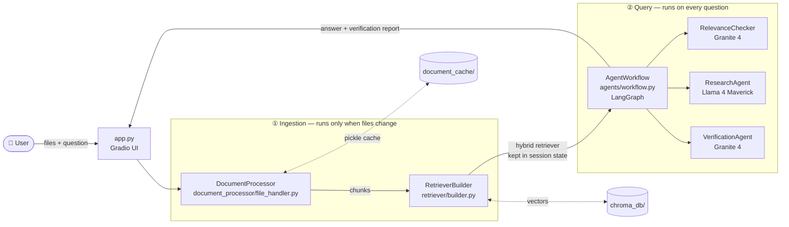
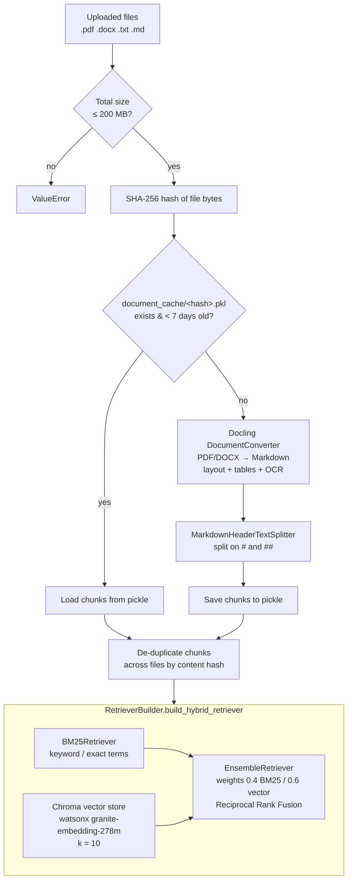
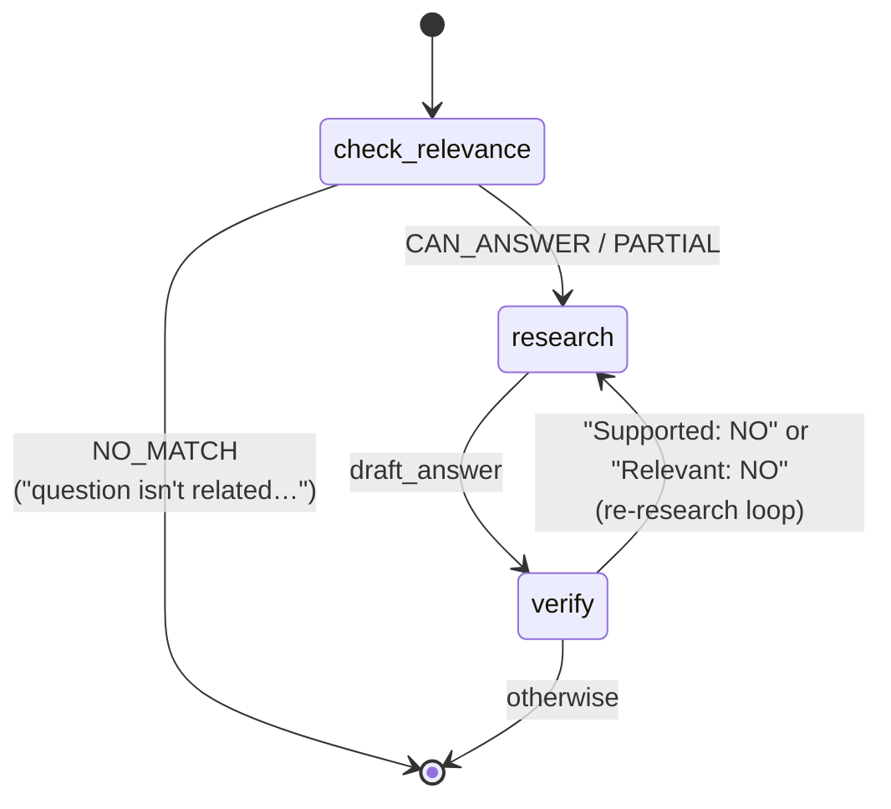
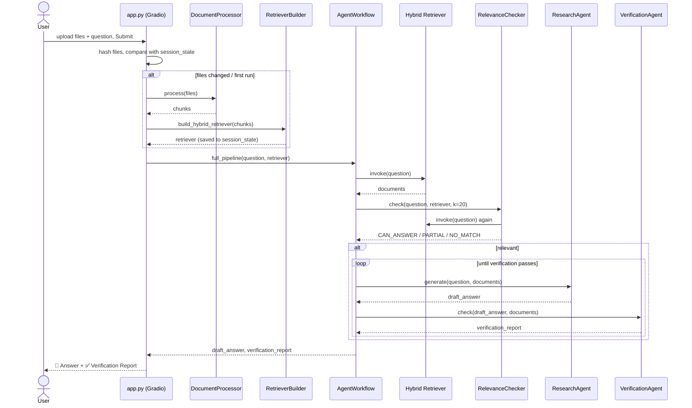

# Multi-Agent RAG System (DocChat 🐥)

A learning project: a **Retrieval-Augmented Generation (RAG)** app where you upload documents, ask a question, and a small team of LLM agents — orchestrated by **LangGraph** — checks relevance, drafts an answer, and fact-checks it against the source text.

> Origin: IBM Skills Network "DocChat" guided project (branch `2-final`), re-homed here for study.

**Stack:** Gradio (UI) · Docling (document parsing) · LangChain (splitting, retrievers) · ChromaDB + BM25 (hybrid search) · IBM watsonx.ai (LLMs + embeddings) · LangGraph (agent workflow)

---

## 1. The big picture



Two phases:

1. **Ingestion** — turn files into searchable chunks and build a retriever. Cached, so re-asking against the same files skips this.
2. **Query** — the LangGraph workflow runs the three agents over the retrieved chunks.

---

## 2. Ingestion pipeline (files → retriever)



**Why these choices**

| Step | Choice | Why it matters for RAG |
|---|---|---|
| Parse | **Docling** → Markdown | Keeps structure (headings, tables) that plain PDF text extraction loses. `test/test1.py` compares it with LangChain's `PyPDFLoader`. |
| Chunk | **Split by Markdown headers** | Chunks follow the document's own sections instead of cutting at a fixed character count, so each chunk is one coherent topic. Header names go into chunk metadata. |
| Cache | **Content hash → pickle** | Docling is slow (layout models, OCR). Hashing the bytes means a renamed copy of the same file still hits the cache. |
| Retrieve | **Hybrid BM25 + vectors** | BM25 catches exact tokens (numbers, names, "PUE", "2022"); embeddings catch paraphrases. The ensemble merges both rankings. |

The app also keeps a second cache: `app.py` stores the set of file hashes in the Gradio `session_state`. If the next question uses the same files, it reuses the retriever it already built and skips ingestion.

---

## 3. The agent workflow (LangGraph state machine)



Every node reads from and writes to a shared `AgentState` dict (`agents/workflow.py`):

```python
class AgentState(TypedDict):
    question: str
    documents: List[Document]      # retrieved once, before the graph starts
    draft_answer: str              # written by research
    verification_report: str       # written by verify
    is_relevant: bool              # written by check_relevance
    retriever: EnsembleRetriever   # passed in so the relevance checker can query
```

A node returns **only the keys it changes**, and LangGraph merges them into the state. Conditional edges are plain functions that read the state and return a route name (`_decide_after_relevance_check`, `_decide_next_step`).

### The three agents

| Agent | File | Model (watsonx) | Temp | Job | Output |
|---|---|---|---|---|---|
| **RelevanceChecker** | `agents/relevance_checker.py` | `ibm/granite-4-h-small` | 0 | Gatekeeper: can these docs answer the question at all? | `CAN_ANSWER` / `PARTIAL` / `NO_MATCH` |
| **ResearchAgent** | `agents/research_agent.py` | `meta-llama/llama-4-maverick-17b-128e-instruct-fp8` | 0.3 | Writer: answer using *only* the retrieved context | `draft_answer` |
| **VerificationAgent** | `agents/verification_agent.py` | `ibm/granite-4-h-small` | 0 | Fact-checker: compare the draft with the context | Report: Supported / Unsupported Claims / Contradictions / Relevant / Details |

Design ideas worth remembering:

- **Guard before generating.** A cheap classifier (`max_tokens=10`) stops off-topic questions before the expensive answer step runs.
- **Generator ≠ verifier.** Using a different model to check the answer lowers the chance that the same blind spot passes its own check.
- **Structured output plus a fallback parser.** The verifier is asked for a fixed `Key: value` format. If parsing fails, it falls back to a safe default (`Supported: NO`).
- **Self-correction loop.** If verification fails, the graph routes back to `research`.

---

## 4. One question, end to end



---

## 5. Project layout

```
.
├── app.py                         # Gradio UI, session caching, entry point (port 5000)
├── agents/
│   ├── workflow.py                # LangGraph StateGraph: nodes, edges, AgentState
│   ├── relevance_checker.py       # Agent 1 – gatekeeper classifier
│   ├── research_agent.py          # Agent 2 – answer drafter
│   └── verification_agent.py      # Agent 3 – fact-checker + report parser/formatter
├── document_processor/
│   └── file_handler.py            # Docling parse → header split → hash cache → dedupe
├── retriever/
│   └── builder.py                 # Chroma (watsonx embeddings) + BM25 → EnsembleRetriever
├── config/
│   ├── constants.py               # size limits, allowed file types
│   └── settings.py                # pydantic-settings (reads .env): k, weights, paths, cache TTL
├── utils/logging.py               # loguru → app.log
├── examples/                      # sample PDFs used by the "Load Example" dropdown
├── test/test1.py                  # Docling vs PyPDFLoader extraction comparison (OCR samples)
└── document_cache/                # pickled chunks keyed by file SHA-256
```

---

## 6. Running it

```bash
python -m venv venv && source venv/bin/activate
pip install -r requirements.txt

# config/settings.py requires this field to exist (it isn't actually used for embeddings)
echo "OPENAI_API_KEY=dummy" > .env

python app.py        # → http://127.0.0.1:5000
```

⚠️ **watsonx credentials:** the agents use `Credentials(url=...)` with `project_id="skills-network"` and **no API key**. That only works inside the IBM Skills Network lab environment. To run it locally:

- add `api_key=...` to the `Credentials(...)` calls, and set your own watsonx `project_id` in the three agents and in `retriever/builder.py`; **or**
- swap `ModelInference` / `WatsonxEmbeddings` for another provider, such as OpenAI or Ollama via LangChain.

Try the built-in examples: choose **Google 2024 Environmental Report** or **DeepSeek-R1 Technical Report** in the dropdown, click **Load Example**, then **Submit**.

---

## 7. Known quirks & ideas to explore (learning notes)

These are worth knowing about when you come back to the code. Each one is also a good exercise.

| # | Quirk | Where | Suggested exercise |
|---|---|---|---|
| 1 | **The re-research loop has no exit.** `research` gets the *same* documents each time, so a failing answer can repeat until LangGraph's recursion limit (25) throws. | `workflow.py::_decide_next_step` | Add an `attempts` counter to `AgentState` and stop after 2–3 tries. Or pass the verifier's feedback into the next research prompt. |
| 2 | **Embeddings only see the first 3 tokens of each chunk.** `TRUNCATE_INPUT_TOKENS: 3` cripples the vector half of hybrid search, so BM25 does most of the work. | `retriever/builder.py` | Raise it to the model's limit (512) and compare answer quality. |
| 3 | **Chroma persists to `./chroma_db` and is never cleared**, so chunks from earlier uploads build up in the same collection. | `retriever/builder.py` | Use an in-memory store, or a collection named after the file hashes. |
| 4 | **Retrieval runs twice per question**: once in `full_pipeline`, again in `RelevanceChecker`. `k=20` is then applied to a list that is already capped. | `workflow.py`, `relevance_checker.py` | Pass `state["documents"]` to the checker instead. |
| 5 | **The `PARTIAL` result is treated the same as `CAN_ANSWER`.** | `workflow.py::_check_relevance_step` | Tell the user the answer may be incomplete, or widen retrieval. |
| 6 | **`OPENAI_API_KEY` is required but unused**, and `config/__init.py__` is misnamed (it works only because Python treats `config` as a namespace package). | `config/` | Clean up. |
| 7 | **No reranker.** The top hybrid results go straight to the LLM. | — | Add a cross-encoder reranker between retrieval and research. |

---

## 8. RAG concepts cheat sheet

- **RAG**: retrieve relevant text first, then have the LLM answer from that text. The model's knowledge then comes from your documents, not just its training data.
- **Chunking**: splitting documents into retrievable pieces. Smaller chunks give more precise matches but less context.
- **Embedding / vector search**: text → vector; nearest neighbours = semantically similar text.
- **BM25**: classic keyword ranking (term frequency × rarity). It's great for exact numbers and names.
- **Hybrid retrieval / RRF**: run both searches and merge the rankings, giving each list a weight.
- **Grounding / verification**: checking that every claim in the answer is supported by the retrieved context, which reduces hallucination.
- **Agentic RAG**: instead of one fixed retrieve-then-generate chain, a graph of specialised steps that can branch (relevance gate) and loop (self-correction).
